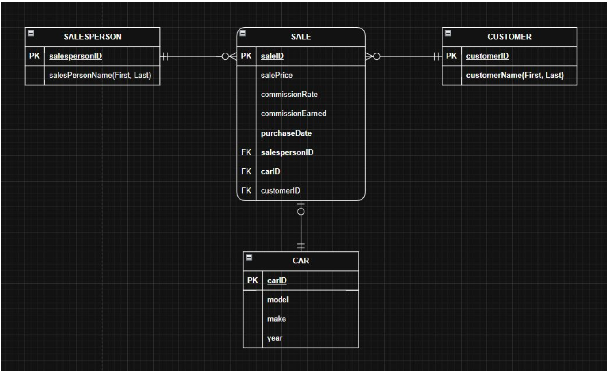
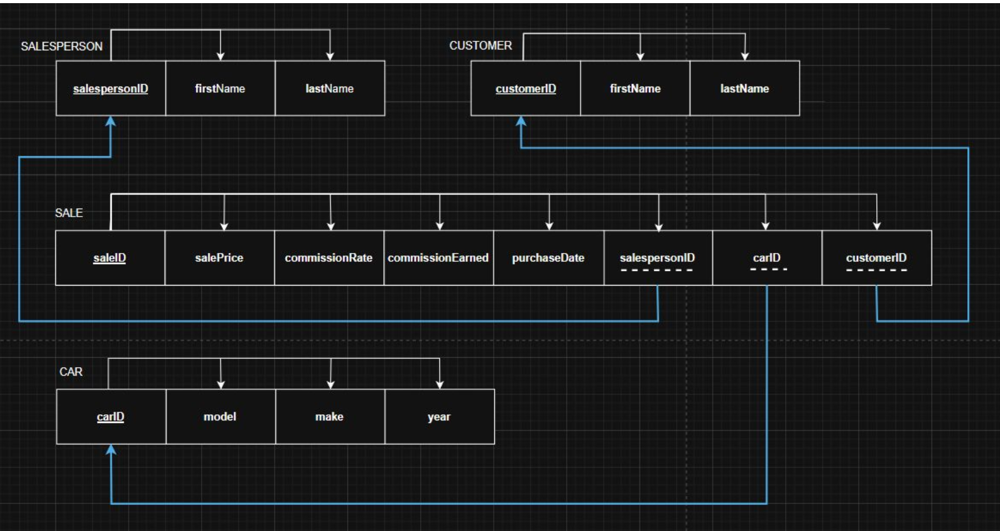
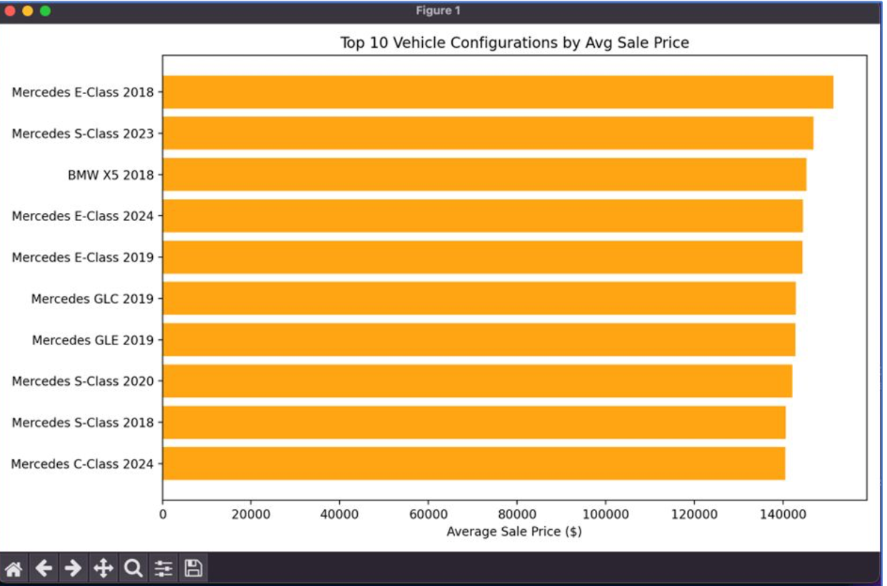

# 🚗 Car Sales Database Analytics

This project designs and analyzes a relational database for car sales data using SQL. It demonstrates database modeling, data querying, and business insights through structured queries.

---

## 📁 Project Structure
car-sales-database-analytics/
│
├── sql/
│ ├── schema_and_data.sql
│ ├── 01_top_selling_car_models.sql
│ ├── 02_average_sale_price_by_make_model_year.sql
│ ├── 03_yearly_sales_trend.sql
│ ├── 04_sales_above_average_sale_price.sql
│ ├── 05_avg_transaction_value_per_salesperson.sql
│ ├── 06_average_commission_per_salesperson.sql
│ └── 07_repeat_customers.sql
│
├── images/
│ ├── entity-relationship.png
│ ├── relational-schema.png
│ └── top-cars-by-price.png
│
└── README.md

---

## 🧱 Database Design

### Entity Relationship Diagram

### Relational Schema

---

## 📊 SQL Analysis

The project includes multiple SQL queries to analyze sales performance:

- Top selling car models  
- Average sale price by make, model, and year  
- Yearly sales trends  
- Sales above average price  
- Average transaction value per salesperson  
- Average commission per salesperson  
- Repeat customers  

---

## 📈 Sample Insight

### Top Vehicle Configurations by Average Sale Price

---

## 🛠️ Technologies Used

- SQL  
- Relational Database Design  

---

## 📌 Summary

This project showcases the full workflow of:
- Designing a relational database  
- Writing analytical SQL queries  
- Extracting meaningful business insights from structured data  
